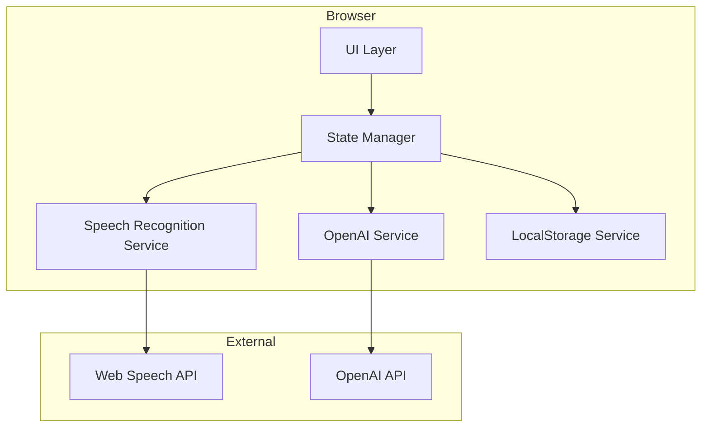

# Design Document

## Overview

Voice Transcriber — одностраничное веб-приложение (SPA), построенное на чистом HTML, CSS и JavaScript без внешних фреймворков. Приложение использует Web Speech API для транскрибации речи и OpenAI API для улучшения и перевода текста.

Ключевые технические решения:
- Vanilla JavaScript для минимального размера бандла и простоты развёртывания
- Web Speech API (SpeechRecognition) для распознавания речи
- CSS Grid/Flexbox для адаптивной вёрстки
- LocalStorage для хранения API ключа
- Fetch API для взаимодействия с OpenAI

## Architecture



Архитектура следует паттерну разделения ответственности:
- **UI Layer**: Отвечает за рендеринг и обработку пользовательских событий
- **State Manager**: Централизованное управление состоянием приложения
- **Services**: Изолированные модули для работы с внешними API и хранилищем

## Components and Interfaces

### 1. SpeechRecognitionService

```typescript
interface SpeechRecognitionService {
  // Начать запись
  start(): void;
  
  // Остановить запись
  stop(): void;
  
  // Проверить поддержку браузером
  isSupported(): boolean;
  
  // Callback для получения результатов
  onResult: (transcript: string, isFinal: boolean) => void;
  
  // Callback для ошибок
  onError: (error: Error) => void;
  
  // Callback для изменения состояния
  onStateChange: (isRecording: boolean) => void;
}
```

### 2. OpenAIService

```typescript
interface OpenAIService {
  // Улучшить текст
  improveText(text: string): Promise<string>;
  
  // Перевести текст на английский
  translateToEnglish(text: string): Promise<string>;
  
  // Установить API ключ
  setApiKey(key: string): void;
  
  // Проверить наличие API ключа
  hasApiKey(): boolean;
}
```

### 3. StorageService

```typescript
interface StorageService {
  // Сохранить API ключ
  saveApiKey(key: string): void;
  
  // Получить API ключ
  getApiKey(): string | null;
  
  // Удалить API ключ
  removeApiKey(): void;
}
```

### 4. AppState

```typescript
interface AppState {
  text: string;              // Текущий текст в текстовом поле
  isRecording: boolean;      // Состояние записи
  isProcessing: boolean;     // Идёт обработка AI
  processingType: 'improve' | 'translate' | null;
  hasApiKey: boolean;        // Наличие API ключа
  error: string | null;      // Текущая ошибка
  notification: string | null; // Уведомление пользователю
}
```

### 5. UI Components

```
┌─────────────────────────────────────────┐
│  Voice Transcriber          [⚙️ Settings]│
├─────────────────────────────────────────┤
│                                         │
│  ┌─────────────────────────────────┐   │
│  │                                 │   │
│  │     Text Area (editable)        │   │
│  │                                 │   │
│  │                                 │   │
│  └─────────────────────────────────┘   │
│                                         │
│  ┌─────┐ ┌─────┐ ┌─────────┐ ┌───────┐ │
│  │ 🎤  │ │ 📋  │ │ Improve │ │Translate│ │
│  └─────┘ └─────┘ └─────────┘ └───────┘ │
│                                         │
└─────────────────────────────────────────┘
```

## Data Models

### API Request/Response

```typescript
// OpenAI Chat Completion Request
interface OpenAIRequest {
  model: string;
  messages: Array<{
    role: 'system' | 'user';
    content: string;
  }>;
  temperature: number;
}

// OpenAI Chat Completion Response
interface OpenAIResponse {
  choices: Array<{
    message: {
      content: string;
    };
  }>;
}
```

### Prompts

```typescript
const IMPROVE_PROMPT = `Улучши следующий текст, сохраняя его смысл:
- Сделай текст более читабельным и структурированным
- Убери повторы и слова-паразиты
- Названия брендов и технологий, произнесённые по-русски, замени на правильное английское написание (например: "ютуб" → "YouTube", "гугл" → "Google", "реакт" → "React")
- Не добавляй новую информацию
- Сохрани язык оригинала (кроме названий брендов)`;

const TRANSLATE_PROMPT = `Переведи следующий текст на английский язык:
- Используй дружелюбный корпоративный стиль
- Сохрани структуру и смысл оригинала
- Названия брендов и технологий пиши правильно`;
```

## Correctness Properties

*A property is a characteristic or behavior that should hold true across all valid executions of a system-essentially, a formal statement about what the system should do. Properties serve as the bridge between human-readable specifications and machine-verifiable correctness guarantees.*

### Property 1: Recording state consistency
*For any* sequence of start/stop recording operations, the UI recording indicator state SHALL always match the actual SpeechRecognition recording state.
**Validates: Requirements 1.1, 1.2, 1.3**

### Property 2: Text preservation on error
*For any* OpenAI API request that fails, the original text in the Text Area SHALL remain unchanged.
**Validates: Requirements 3.8, 4.6**

### Property 3: Button state consistency
*For any* application state, buttons SHALL be disabled if and only if their preconditions are not met (empty text for copy/translate/improve, missing API key for AI operations, processing in progress).
**Validates: Requirements 2.3, 4.5, 3.7**

### Property 4: API key persistence round-trip
*For any* valid API key string, saving to storage and then retrieving SHALL return the same key value.
**Validates: Requirements 5.2, 5.3**

### Property 5: Transcription accumulation
*For any* sequence of speech recognition results, the Text Area SHALL contain the concatenation of all final transcripts in order.
**Validates: Requirements 1.1, 1.2**

## Error Handling

| Error Type | User Message | Recovery Action |
|------------|--------------|-----------------|
| Browser not supported | "Ваш браузер не поддерживает распознавание речи. Используйте Chrome или Edge." | Disable record button |
| Microphone access denied | "Доступ к микрофону запрещён. Разрешите доступ в настройках браузера." | Show retry option |
| OpenAI API error | "Ошибка при обработке текста. Проверьте API ключ и попробуйте снова." | Preserve original text |
| Network error | "Нет подключения к интернету. Проверьте соединение." | Preserve original text |
| Empty API key | "Введите API ключ OpenAI в настройках." | Open settings modal |

## Testing Strategy

### Unit Testing

Используем Vitest для модульного тестирования:

- **StorageService**: тесты сохранения/получения/удаления API ключа
- **OpenAIService**: тесты формирования запросов, обработки ответов и ошибок (с моками fetch)
- **State management**: тесты переходов состояний

### Property-Based Testing

Используем **fast-check** для property-based тестирования:

1. **API key round-trip**: Для любого валидного ключа, save → get возвращает тот же ключ
2. **Button state consistency**: Для любого состояния приложения, состояние кнопок соответствует предусловиям
3. **Text preservation on error**: Для любого текста и ошибки API, текст сохраняется

Каждый property-based тест будет выполняться минимум 100 итераций.

Формат аннотации тестов:
```javascript
// **Feature: voice-transcriber, Property 4: API key persistence round-trip**
```

### Integration Testing

- Тестирование взаимодействия UI с сервисами
- E2E тесты основных сценариев использования (опционально, с Playwright)

### Manual Testing

- Проверка работы Web Speech API в разных браузерах
- Проверка адаптивности на разных устройствах
- Проверка UX при медленном соединении
